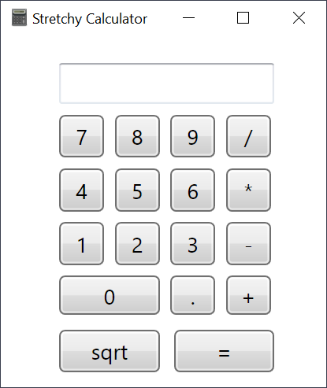

# A Stretchy Calculator

This is a simple calculator app in C#. The _StretchyCalculator.sln_ solution will (should) compile in video studio. It uses XAML for the interface. The app's Window can be stretched (resized) bigger/smaller.

